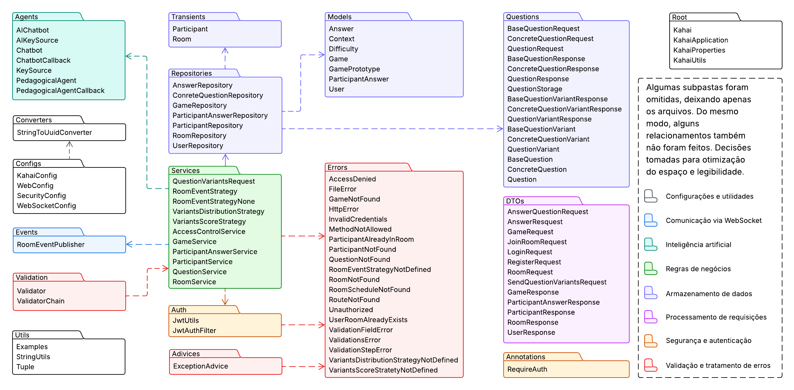
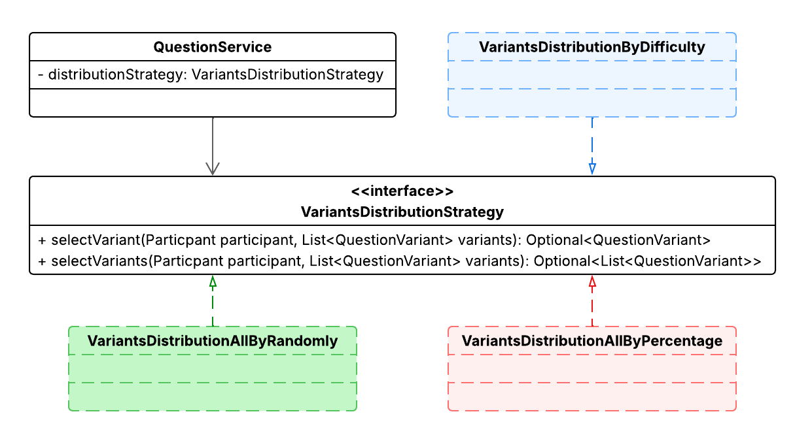

# Sumário
- [Resumo](#resumo)
- [Visão geral](#visão-geral)
- [Pontos fixos](#pontos-fixos)
- [Pontos flexíveis e padrões de projeto](#pontos-flexíveis-e-padrões-de-projeto)
    - [Tipos diferentes de questões](#tipos-diferentes-de-questões)
        - [Consequência](#consequência)
    - [Estratégia de distribuição das questões](#estratégia-de-distribuição-das-questões)
    - [Estratégia de pontuação](#estratégia-de-pontuação)
    - [Estratégia de eventos de sala](#estratégia-de-eventos-de-sala)
    - [Clonagem de jogos](#clonagem-de-jogos)
    - [Chaves e modelo da AI](#chaves-e-modelo-da-ai)

# Resumo

Este pacote se trata de uma proposta de `framework` para a criação de aplicações de perguntas e respostas baseadas similares ao `Kahoot`, porém, que utilizando um Agente (`IA`) para elaborar variações de questões. 

Ele foi completamente desenvolvido durante a disciplina de `PDS - Projeto de Detalhado de Software` e, para testá-lo, foram desenvolvidas três instâncias (aplicações). Sendo elas:

- [Hakai (azul)](https://github.com/l-marcel/hakai);
- [Provai (vermelho)](https://github.com/L-Marcel/hakai/tree/provai);
- [Revai (verde)](https://github.com/L-Marcel/hakai/tree/revai).

# Visão geral

Segue uma imagem descrevendo a estrutura interna do framework:



# Pontos fixos

Deixamos como pontos fixos:

- Autenticação e recursos de usuários;
- Notificações básicas da IA;
- Prompt de sistema da IA;
- Gerenciamento do websocket;
- Geração das variações;
- Gerenciamento de salas (parcial).

# Pontos flexíveis e padrões de projeto

Como requisito, foram elaborados os seguintes `pontos flexíveis`.

## Chaves, modelo da AI, etc...

Este ponto flexível, ao contrário de todos os demais que desenvolvemos, é característico do tipo `Black-Box`. Em síntese, o `Kahai` permite
que você defina as seguintes configurações através do arquivo `.properties`.

> Estamos usando o `OpenRouter`, então os modelos devem vir dele. Isso pode ser considerado um ponto fixo também.

```.properties
kahai.cors.allowedOrigins=http://localhost:5173
kahai.cors.allowCredentials=true
kahai.jwt.expiration=86400000
kahai.ai.model=mistralai/mistral-small-3.2-24b-instruct:free
kahai.ai.temperature=0
kahai.websocket.endpoint=/websocket
kahai.websocket.allowedOrigins=*
kahai.websocket.simpleBroker=/channel/events/rooms
kahai.websocket.applicationDestinationPrefixes=/channel/triggers/rooms
kahai.jwt.secret=8qZ#E$t&G)J@McQfTjWnZr4u7x!A%C*F-JaNdRgUkXp2s5v8y/B?D(G+KbPeShVm
kahai.ai.keys=<KEY 1>,<KEY 2>, <KEY 3>, ...
```

Fora os do próprio `Spring Boot`:

```.properties
spring.application.name=backend
spring.datasource.url=jdbc:postgresql://localhost:5433/hakai
spring.datasource.username=admin
spring.datasource.password=admin
spring.jpa.database-platform=org.hibernate.dialect.PostgreSQLDialect
spring.jpa.hibernate.ddl-auto=update
spring.mvc.throw-exception-if-no-handler-found=true
spring.web.resources.add-mappings=false
spring.config.import=classpath:secret.properties
spring.jpa.open-in-view=true
logging.level.root=WARN
logging.level.org.kahai=DEBUG
logging.level.org.kahai.framework.auth.JwtAuthFilter=WARN
logging.level.org.springframework=WARN
logging.level.org.hibernate=ERROR
logging.level.org.apache.catalina=WARN
logging.level.org.apache.coyote=WARN
logging.level.com.zaxxer.hikari=WARN
```

## Tipos diferentes de questões

Aplicando o padrão de projeto `decorator` conseguimos estender as possibilidades
de tipos de questões.


### Consequência

Como consequência de aplicar esse padrão nesta `entidade`, tivemos que aplicar também em outras `classes` relacionadas.


## Estratégia de distribuição das questões

Aplicando o padrão de projeto `strategy` conseguimos estender as possibilidades de
distribuição das questões para os participantes.




## Estratégia de pontuação

Aplicando o padrão de projeto `strategy` conseguimos estender as possibilidades de
cálculo das pontuações.


## Estratégia de eventos de sala

Aplicando o padrão de projeto `strategy` conseguimos adicionar a possibilidade de
capturar determinados eventos de sala.


## Clonagem de jogos

Aplicando o padrão de projeto `prototype` conseguimos adicionar a possibilidade de
clonar jogos (template de salas) entre os usuários.


